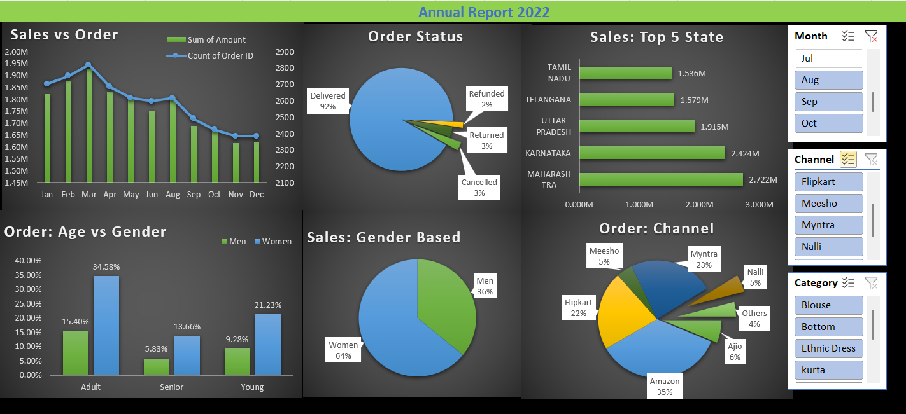

# 📊 Store Sales Analysis Dashboard

## 📌 Overview
This project analyzes Store's sales data using Microsoft Excel to uncover sales trends, customer behavior, and business performance through an interactive dashboard.

## 🎯 Objectives
- Analyze overall sales performance
- Identify top-performing states
- Understand customer demographics
- Track monthly sales trends
- Generate actionable business insights

## 🛠️ Tools Used
- Microsoft Excel
- Pivot Tables
- Pivot Charts
- Slicers
- Conditional Formatting
- Data Cleaning

## 📈 Key Performance Indicators (KPIs)
- Total Sales
- Total Orders
- Average Order Value
- Monthly Sales Trend
- Top States
- Top Categories
- Sales Channel Performance

## 📷 Dashboard Preview

## 💡 Key Insights
- Women contributed a higher share of total sales.
- Maharashtra generated the highest revenue.
- Amazon was the best-performing sales channel.
- Adult customers represented the largest customer segment.
- March recorded the highest sales.

## 🚀 Business Recommendations
- Increase inventory in high-performing states.
- Focus marketing campaigns on women customers.
- Strengthen top-performing sales channels.
- Promote high-selling product categories.

## 📂 Repository Contents
- 📄 `Store Sales Data Analysis.xlsx`
- 🖼️ `dashboard.png`
- 📝 `README.md`

## 🔧 How to Use
1. Clone or download this repository
2. Open `Store Dashboard.xlsx` in Microsoft Excel
3. Use slicers (Month, Channel, Category) to filter data interactively
4. Explore pivot charts for detailed insights

## 👤 Author
**Harshvardhan Singh**  
Aspiring Data Analyst | Chemical Engineering Student at NIT Calicut

